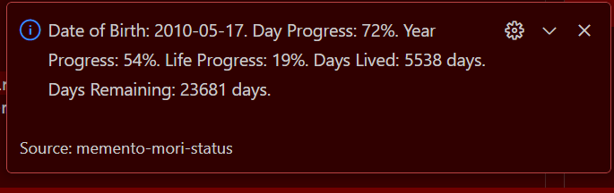
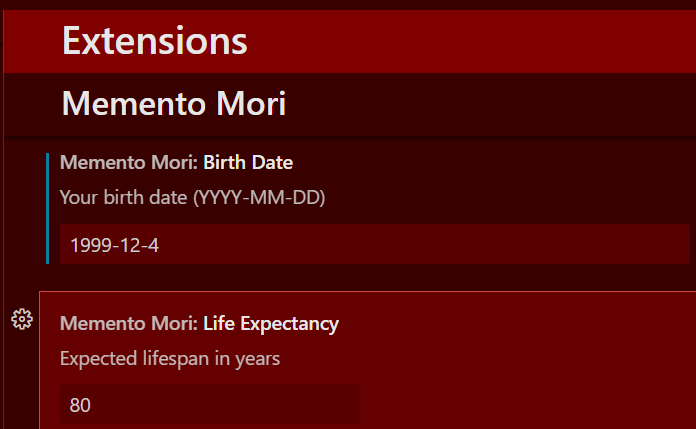

# Memento Mori Status

**A simple VS Code extension that shows how much of your day, month, year, and expected life has passed.**

---

## Features

- 🕒 **Day, Month, Year, Life progress** measured as percentages (e.g., `Day: 45%`) (configurable)
- 📊 **Graphical bars** in tooltips for a quick visual glance
- 🔍 **Popup command** (`Show Full Stats`) displaying days/weeks lived and remaining
- ⚙️ **Interactive configuration**: command to update your birth date in settings

---

## Screenshots
  
*Example of daily progress visualization.*

  
*Detailed stats popup showing life progress.*

## Usage

1. Install the extension.
2. Check the status bar:  
    ```
    Day: 45% Month: 37% Year: 26% Life: 12%
    ```
3. Hover over the status bar for a visual progress bar in the tooltip.  
4. Open the Command Palette (`Ctrl+Shift+P`) and run:
    - **Memento Mori: Show Full Stats** – displays a detailed stats popup.
    - **Memento Mori: Set Birth Date** – prompts you to enter a new date of birth.

---

## Configuration

Update settings in VS Code (`settings.json`):

```json
"mementoMori.birthDate": "2000-05-15",
"mementoMori.lifeExpectancy": 82
"mementoMori.displayFormat": "Day: {dayProgress}% Month: {monthProgress}% Year: {yearProgress}% Life: {lifeProgress}%"
```

**Defaults:**  
- `birthDate`: `1990-01-01`  
- `lifeExpectancy`: `80 years`
- `displayFormat` : `Day: {dayProgress}% Month: {monthProgress}% Year: {yearProgress}% Life: {lifeProgress}%`