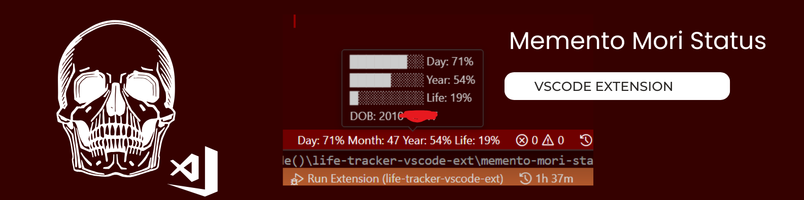

<p align="center">
   
</p>

<h1 align="center">Memento Mori Status</h1>

<p align="center">A simple VS Code extension that shows how much of your day, month, year, and expected life has passed.</p>

<p align="center">
<a href="#features">Features</a> • 
<a href="#usage">Usage</a> • 
<a href="#configuration">Configuration</a> • 
<a href="#screenshots">Screenshots</a> • 
<a href="#changelog">Changelog</a> • 
<a href="#contributing">Contributing</a> • 
<a href="#license">License</a>
</p>

<p align="center">


</p>

## Features

- 🕒 **Day, Month, Year, Life progress** measured as percentages (e.g., `Day: 45%`) (configurable)
- 📊 **Graphical bars** in tooltips for a quick visual glance
- 🔍 **Popup command** (`Show Full Stats`) displaying days/weeks lived and remaining
- ⚙️ **Interactive configuration**: command to update your birth date in settings

---

## Usage

1. Install the extension.
2. Check the status bar:
    ```
    Day: 45% Month: 37% Year: 26% Life: 12%
    ```
3. Hover over the status bar for a progress bar in the tooltip.
4. Open the Command Palette (`Ctrl+Shift+P`) and run:
    - **Memento Mori: Show Full Stats** – displays a detailed stats popup.
    - **Memento Mori: Set Birth Date** – prompts you to enter a new date of birth.
    - **Memento Mori: Reset Configuration** - resets all settings to default

---

## Configuration

You can customize the extension using the following settings:

- `mementoMori.birthDate`: Your birth date in `YYYY-MM-DD` format. Default: `1990-01-01`.
- `mementoMori.lifeExpectancy`: Your expected lifespan in years. Default: `80`.
- `mementoMori.displayFormat`: Template for the status bar text. Default: `Day %dayProgress% · Year %yearProgress% · Life %lifeProgress%`.
    - Tokens: `%dayProgress%`, `%dayRemaining%`, `%monthProgress%`, `%monthRemaining%`, `%yearProgress%`, `%yearRemaining%`, `%lifeProgress%`, `%lifeRemaining%`, `%ageYears%`, `%ageYearsMonthsDays%`, `%daysLived%`, `%daysLeftLife%`, `%daysUntilBirthday%`.
    - Legacy placeholders still work: `{dayProgress}`, `{monthProgress}`, `{yearProgress}`, `{lifeProgress}`.

## Screenshots

## Changelog

See the [CHANGELOG](CHANGELOG.md) for details on changes in each version.

## Contributing

Contributions are welcome! Feel free to open issues or submit pull requests on the [GitHub repository](https://github.com/infinotiver/memento-mori-status).

## License

This project is licensed under the MIT License. See the [LICENSE](LICENSE) file for details.
